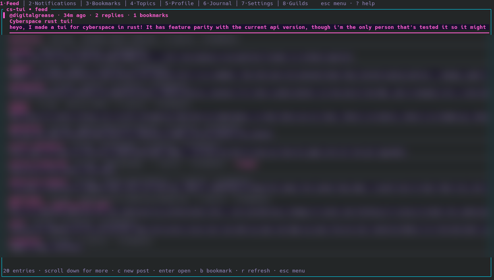

# cs-tui

A terminal client for [cyberspace.online](https://cyberspace.online), targeting the v0.5.0 API.



*The feed in the `vapor` theme (one of five built-in themes; see [Configuration](#configuration)).*

## Status

Early development. Most of the documented v0.5.0 REST surface is implemented; live testing against the API is ongoing. Chat and DMs await the published Firebase RTDB schema.

## Features

- **Feed** with cursor-based infinite scroll and entry titles
- **Post detail** with threaded replies
- **Notifications** with read/unread filtering and an unread badge
- **Bookmarks**, **Topics**, and per-topic feeds
- **Profiles** (info / posts / replies / followers / following) with follow & unfollow
- **Compose** posts and replies via your `$EDITOR`; delete your own entries
- **Guilds** — browse member groups, view threads/members, join/leave, and post threads
- **Journal** (private notes) with revision history
- **Settings** round-trip that preserves fields the client doesn't model
- Markdown rendering with `@mention` highlighting
- Inline image rendering in post detail on graphics-capable terminals (Kitty/iTerm2/Sixel); `[image] url` placeholder elsewhere
- Five built-in themes (`cyber`, `c64`, `vt320`, `dark`, `vapor`), switchable at runtime, plus a `custom` palette defined in `config.toml`
- Per-endpoint rate limiting and one-shot token refresh on 401

## Install

Download the archive for your platform from the [latest release](https://github.com/digital-grease/cs-tui/releases/latest), extract it, and run the binary. No Rust toolchain required.

| Platform | Asset | Notes |
|---|---|---|
| Linux (any distro) | `cs-tui-<ver>-x86_64-unknown-linux-musl.tar.gz` | Fully static; the most portable Linux build. |
| Linux (glibc) | `cs-tui-<ver>-x86_64-unknown-linux-gnu.tar.gz` | Needs glibc 2.39 or newer. |
| macOS (Apple Silicon) | `cs-tui-<ver>-aarch64-apple-darwin.tar.gz` | |
| macOS (Intel) | `cs-tui-<ver>-x86_64-apple-darwin.tar.gz` | |
| Windows | `cs-tui-<ver>-x86_64-pc-windows-msvc.zip` | Windows 10 or newer. |

```sh
# Linux / macOS
tar xzf cs-tui-*-x86_64-unknown-linux-musl.tar.gz
./cs-tui
# optionally put it on your PATH
install -m 755 cs-tui ~/.local/bin/
```

On macOS the binaries are not notarized, so the first launch is blocked by Gatekeeper. Right-click the binary and choose Open, or clear the quarantine flag:

```sh
xattr -d com.apple.quarantine cs-tui
```

On Windows, SmartScreen may warn on the unsigned `.exe` (choose More info, then Run anyway). No extra runtime is needed on Windows 10 or newer.

## Build from source

```sh
cargo build --release
./target/release/cs-tui --help
```

Requires Rust 1.81+ (stable channel; see `rust-toolchain.toml`).

## Usage

```sh
# Launch
cs-tui

# Verbose logging (written to the log file, not the terminal)
cs-tui --debug
```

On first launch you log in with your cyberspace.online email and password. The
session is saved (see [Files](#files)) and reused on the next launch until you
log out.

### Keys

| Key | Action |
|---|---|
| `1`–`8` | Switch section: Feed · Notifications · Bookmarks · Topics · Profile · Journal · Settings · Guilds |
| `j`/`k` or `↑`/`↓` | Move down / up |
| `g`/`G` or `Home`/`End` | Jump to top / bottom |
| `Enter` | Open / select |
| `r` | Refresh |
| `c` | Compose / new |
| `Esc` | Open the menu (Back · Logout · Theme · Quit) |
| `?` | Help overlay |
| `Backspace` | Go back |
| `Ctrl+C` | Quit |

Each screen shows its own context keys in the status bar, and `?` opens a help
overlay anywhere you aren't typing into a field.

### Themes

Cycle palettes at runtime via **Esc → Theme**; the selection is remembered
between runs. Set a default (or define a `custom` palette) in `config.toml`.

## Files

| Path | Purpose |
|---|---|
| `~/.config/cs-tui/config.toml` | User configuration (see [Configuration](#configuration)) |
| `~/.config/cs-tui/session.json` | Saved login session (mode `0600` on Unix) |
| `~/.config/cs-tui/prefs.json` | UI preferences (e.g. selected theme) |
| `~/.local/state/cs-tui/cs-tui.log` | Log output (`--debug` / `RUST_LOG` raise verbosity) |

(Paths follow the XDG base directory spec; locations differ on macOS/Windows.)

## Configuration

On first run, cs-tui writes a commented `config.toml` to
`~/.config/cs-tui/config.toml` (override with `--config <path>` or
`$CS_TUI_CONFIG`). It is never overwritten, so your edits and comments are safe.
Every option is optional and shown at its default; restart to apply changes.

### Appearance

| Option | Default | Notes |
|---|---|---|
| `theme` | `cyber` | One of `cyber`, `c64`, `vt320`, `dark`, `vapor`, `custom`. The in-app Esc → Theme menu overrides this and is remembered separately. |
| `[colors]` | built-in | Custom palette, used when `theme = "custom"`. Keys: `background`, `foreground`, `muted`, `accent`, `success`, `error`, `warning`, `border`. Each is a hex (`"#1e1e2e"`), `"reset"`, or an ANSI index (`"0"` to `"255"`); omitted keys keep the default. |
| `compact` | `false` | Drop the blank-line / rule separators between list items for a denser feed. |

### Time

| Option | Default | Notes |
|---|---|---|
| `time_format` | `relative` | `relative` ("2h ago") or `absolute` ("2026-05-31 14:30"). |
| `timezone` | `utc` | For absolute timestamps: `utc`, or a fixed offset like `-05:00`, `+02:00`, `+0530`. |

### Behavior

| Option | Default | Notes |
|---|---|---|
| `start_section` | `feed` | Section opened on launch: `feed`, `notifications`, `bookmarks`, `topics`, `profile`, `journal`, `settings`, `guilds`. |
| `nsfw` | `false` | Show NSFW posts by default (otherwise hidden until toggled). |
| `confirm_deletes` | `true` | Require the two-step `d` then `y` confirmation before deleting a post or note. |
| `feed_autorefresh` | `true` | Auto-refresh the feed in the background: new entries are prepended at the top without moving your scroll position (only while the feed is on screen). |
| `feed_refresh_secs` | `60` | Seconds between background feed polls. Minimum 10; lower values use more of the read rate limit. |
| `editor` | `$VISUAL`, then `$EDITOR`, then `nano` | Editor for composing posts and notes. |
| `preview_length` | `200` | Characters of post content shown in list previews (clamped 20 to 2000). |
| `image_height` | `20` | Max rows for the inline image strip in post detail (clamped 1 to 60). |

### Input and rendering

| Option | Default | Notes |
|---|---|---|
| `mouse` | `false` | Capture the scroll wheel for in-app scrolling. Off keeps native terminal select/copy. `--mouse` forces it on. |
| `images` | `true` | Render inline images on graphics-capable terminals. `--no-images` forces it off. |
| `api_base` | `https://api.cyberspace.online` | Override the API base URL. |

## Layout

| Path | Purpose |
|---|---|
| `crates/cs-api/` | HTTP client + types for the Cyberspace REST API |
| `crates/cs-tui/` | Ratatui application (binary) |
| `docs/api-v0.5.0.md` | Authoritative API specification (do not modify) |

## License

Licensed under either of

- Apache License, Version 2.0 ([LICENSE-APACHE](LICENSE-APACHE))
- MIT license ([LICENSE-MIT](LICENSE-MIT))

at your option.

### Contribution

Unless you explicitly state otherwise, any contribution intentionally submitted
for inclusion in the work by you, as defined in the Apache-2.0 license, shall be
dual licensed as above, without any additional terms or conditions.
