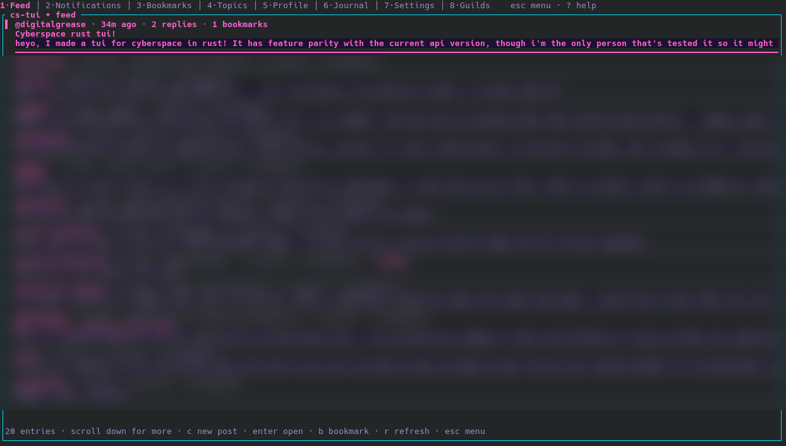

# cs-tui

A terminal client for [cyberspace.online](https://cyberspace.online), targeting the v0.8.10 API.



*The feed in the `vapor` theme, one of seven built in.*

## Status

Early development. Most of the documented v0.8.10 REST surface is implemented,
including private C-Mail and multi-user cIRC chat (REST plus live streaming),
full-text search and the program registry. Live testing against the API is
ongoing.

## Features

- **Feed, topic feeds and post detail**: infinite scroll, threaded replies, markdown and `@mention` highlighting
- **Compose** posts and replies in a built-in editor, edit and delete your own, and attach a jukebox track
- **Notifications** across the full v0.8.10 type list, with read/unread filtering and an unread badge
- **Thread watching** for reply notifications, armed automatically on anything you reply to or are named in
- **cIRC** chat rooms with live streaming: a roster of who is present and idle, per-room mutes, and an action menu for the message under the cursor
- **C-Mail** private conversations with live streaming, an unread badge and typing indicators both ways
- **Chat text styles**: `/art` is decoded and drawn, `/spoiler` masks until you reveal it, and the rest render as close as a terminal gets. The animated ones are static unless you ask for animation
- **Guilds**: browse, join, leave, post threads, and move your profile badge between them, apprenticeships included
- **Programs**: browse the registry, read and save any release's source, publish and recall your own. cs-tui does not run programs, it is a place to read one
- **Profiles**, **Bookmarks**, **Topics**, **Journal** (private notes with revision history) and **Settings**
- **Jukebox playback** of the tracks posts carry, shuffle included, when `mpv` and `yt-dlp` are installed
- **Inline images** in post detail on Kitty, iTerm2 and Sixel terminals
- **Seven themes** plus a custom palette, switchable at runtime

## Install

cs-tui is one ready-to-run program file. There is nothing to install, and no
Rust toolchain or other software to set up first.

It runs *inside* a terminal window, so double-clicking it will not get you far.
You will need a terminal open: **Terminal** on macOS (Applications → Utilities),
**Windows Terminal** or **PowerShell** on Windows, or whichever terminal app
your Linux desktop ships with.

Every download is on the [latest release page](https://github.com/digital-grease/cs-tui/releases/latest).

### macOS

Download **`aarch64-apple-darwin.tar.gz`** for an Apple Silicon Mac (M1 and
newer) or **`x86_64-apple-darwin.tar.gz`** for an Intel one (Apple menu → About
This Mac). Double-click it in Finder to unpack, then in Terminal:

```sh
cd ~/Downloads
xattr -d com.apple.quarantine cs-tui
./cs-tui
```

The `xattr` line tells macOS you trust the program. Without it macOS refuses to
open it, because these builds are not signed with a paid Apple certificate.

### Windows

Download **`x86_64-pc-windows-msvc.zip`** (Windows 10 or newer). Right-click it
in File Explorer, **Extract All**, then **Extract**. Open the resulting folder,
right-click an empty spot inside it, choose **Open in Terminal**, and run:

```powershell
.\cs-tui.exe
```

If Windows shows a blue "Windows protected your PC" box, choose **More info**,
then **Run anyway**. That appears because the program is not signed with a paid
certificate, not because anything is wrong with it.

### Linux

Download **`x86_64-unknown-linux-musl.tar.gz`**, which works on any
distribution. Then:

```sh
cd ~/Downloads
tar xzf cs-tui-*-x86_64-unknown-linux-musl.tar.gz
./cs-tui
```

<details>
<summary>Running it from anywhere, all downloads, building from source</summary>

To launch it by typing `cs-tui` from any folder, move it somewhere your shell
looks for programs. On macOS and Linux, `install -m 755 cs-tui ~/.local/bin/`
(if that still does not find it, `~/.local/bin` is not on your `PATH` yet). On
Windows, put `cs-tui.exe` wherever you like and add that folder to your `PATH`.

| Platform | Asset | Notes |
|---|---|---|
| Linux (any distro) | `cs-tui-<ver>-x86_64-unknown-linux-musl.tar.gz` | Fully static; the most portable Linux build. |
| Linux (glibc) | `cs-tui-<ver>-x86_64-unknown-linux-gnu.tar.gz` | Needs glibc 2.39 or newer. |
| macOS (Apple Silicon) | `cs-tui-<ver>-aarch64-apple-darwin.tar.gz` | |
| macOS (Intel) | `cs-tui-<ver>-x86_64-apple-darwin.tar.gz` | |
| Windows | `cs-tui-<ver>-x86_64-pc-windows-msvc.zip` | Windows 10 or newer. |

Every archive has a matching `.sha256` file next to it if you want to verify the
download.

To build from source, which is only needed for changes that are not in a release
yet, requires Rust 1.81+ (stable; see `rust-toolchain.toml`):

```sh
cargo build --release
./target/release/cs-tui --help
```

</details>

## Usage

```sh
cs-tui           # launch
cs-tui --debug   # verbose logging, written to the log file
```

On first launch you log in with your cyberspace.online email and password. The
session is saved and reused on the next launch until you log out.

cs-tui is keyboard-driven: the left and right arrows move between sections, each
screen shows its own keys in the status bar, and `?` opens a help overlay
anywhere you are not typing into a field.

## Reference

| | |
|---|---|
| [KEYS.md](KEYS.md) | Every key by screen, and the jukebox controls |
| [CONFIG.md](CONFIG.md) | Every `config.toml` option |

## Files

| Path | Purpose |
|---|---|
| `~/.config/cs-tui/config.toml` | User configuration |
| `~/.config/cs-tui/session.json` | Saved login session (mode `0600` on Unix) |
| `~/.config/cs-tui/prefs.json` | UI preferences (e.g. selected theme) |
| `~/.local/state/cs-tui/cs-tui.log` | Log output (`--debug` / `RUST_LOG` raise verbosity) |

Paths follow the XDG base directory spec; locations differ on macOS and Windows.

## Layout

| Path | Purpose |
|---|---|
| `crates/cs-api/` | HTTP client and types for the Cyberspace REST API |
| `crates/cs-tui/` | Ratatui application (binary) |

Code comments cite the Cyberspace API specification by section name (for
example, § Join a Guild) so they stay readable without it to hand.

## License

Licensed under either of

- Apache License, Version 2.0 ([LICENSE-APACHE](LICENSE-APACHE))
- MIT license ([LICENSE-MIT](LICENSE-MIT))

at your option.

### Contribution

Unless you explicitly state otherwise, any contribution intentionally submitted
for inclusion in the work by you, as defined in the Apache-2.0 license, shall be
dual licensed as above, without any additional terms or conditions.
